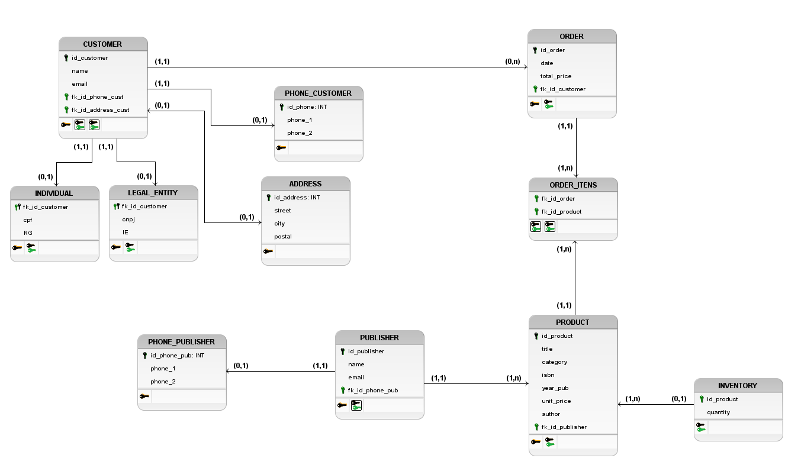

# DataModeling-BookStore
This repository contains a data project builded for a fictitious book store aimed to creating and modeling a database. 

## 1. Conceptual Model

#### Understanding business requirements

```
As a Brazilian bookstore, our business is growing and we need to improve our data organization. That's why it was decided to invest in a project to model and create a database.
We want to collect the personal data of our customers, such as whether he is an individual (CPF and RG) or a legal entity (CNPJ and IE). In addition, we want to collect and store your names, addresses, telephone numbers and email addresses.
The main product of e-commerce is books. These books have information associated with them such as title, category, ISBN (International Standard Book Number), year of publication, price, publisher, as well as the author of the work.
Books are provided by publishers. We need to keep the publisher's contact names, phone numbers (maximum 2 numbers) and email.
We know that we cannot have the same book coming from several publishers. The book is exclusive to one publisher.
Our customer can buy one or more books through a purchase order. However, whenever he makes a purchase, we need to check the inventory whether or not the book is available before carrying out the operation.
```

#### Visual representation
<p align="center">  </p>
This image was made using software:

[brModelo](https://www.brmodeloweb.com/lang/pt-br/index.html)

## 2. Logic Model
<p align="center">  </p>
This image was made using software:

[brModelo](https://www.brmodeloweb.com/lang/pt-br/index.html)


## 3. Physical Model
```
/* BookStoreModel-Logic: */

CREATE TABLE CUSTOMER (
    id_customer VARCHAR(20) PRIMARY KEY,
    name VARCHAR(50) NOT NULL,
    email VARCHAR(50) NOT NULL,
    fk_id_phone_cust VARCHAR(20),
    fk_id_address_cust VARCHAR(20)
);

CREATE TABLE PUBLISHER (
    id_publisher VARCHAR(20) PRIMARY KEY,
    name VARCHAR(50) NOT NULL,
    email VARCHAR(50) NOT NULL,
    fk_id_phone_pub VARCHAR(20)
);

CREATE TABLE PRODUCT (
    id_product VARCHAR(20) PRIMARY KEY,
    title VARCHAR(50) NOT NULL,
    category VARCHAR(50) NOT NULL,
    isbn INTEGER NOT NULL,
    year_pub INTEGER NOT NULL,
    unit_price DECIMAL(5,2) NOT NULL,
    author VARCHAR(50) NOT NULL,
    fk_id_publisher VARCHAR(20)
);

CREATE TABLE ORDERS (
    id_order VARCHAR(20) PRIMARY KEY,
    date DATE NOT NULL,
    total_price DECIMAL NOT NULL,
    fk_id_customer VARCHAR(20)
);

CREATE TABLE INVENTORY (
    id_product VARCHAR(20),
    quantity INTEGER NOT NULL
);

CREATE TABLE ORDER_ITENS (
    fk_id_order VARCHAR(20),
    fk_id_product VARCHAR(20)
);

CREATE TABLE LEGAL_ENTITY (
    fk_id_customer VARCHAR(20) PRIMARY KEY,
    cnpj VARCHAR(20) NOT NULL,
    IE VARCHAR(20) NOT NULL
);

CREATE TABLE INDIVIDUAL (
    fk_id_customer VARCHAR(20) PRIMARY KEY,
    cpf VARCHAR(15) NOT NULL,
    RG VARCHAR(15) NOT NULL
);

CREATE TABLE PHONE_CUSTOMER (
    id_phone VARCHAR(20) NOT NULL PRIMARY KEY,
    phone_1 VARCHAR(14),
    phone_2 VARCHAR(14)
);

CREATE TABLE ADDRESS (
    id_address VARCHAR(20) NOT NULL PRIMARY KEY,
    street VARCHAR(50) NOT NULL,
    city VARCHAR(50) NOT NULL,
    postal VARCHAR(50) NOT NULL
);

CREATE TABLE PHONE_PUBLISHER (
    id_phone_pub VARCHAR(20) NOT NULL PRIMARY KEY,
    phone_1 VARCHAR(14),
    phone_2 VARCHAR(14)
);
 
ALTER TABLE CUSTOMER ADD CONSTRAINT FK_CUSTOMER_PHONE
    FOREIGN KEY (fk_id_phone_cust)
    REFERENCES PHONE_CUSTOMER (id_phone)
    ON DELETE CASCADE
    ON UPDATE CASCADE;
 
ALTER TABLE CUSTOMER ADD CONSTRAINT FK_CUSTOMER_ADDRESS
    FOREIGN KEY (fk_id_address_cust)
    REFERENCES ADDRESS (id_address)
    ON DELETE CASCADE
    ON UPDATE CASCADE;
 
ALTER TABLE PUBLISHER ADD CONSTRAINT FK_PUBLISHER_PHONE
    FOREIGN KEY (fk_id_phone_pub)
    REFERENCES PHONE_PUBLISHER (id_phone_pub)
    ON DELETE CASCADE
    ON UPDATE CASCADE;
 
ALTER TABLE PRODUCT ADD CONSTRAINT FK_PRODUCT_PUBLISHER
    FOREIGN KEY (fk_id_publisher)
    REFERENCES PUBLISHER (id_publisher)
    ON DELETE RESTRICT
    ON UPDATE RESTRICT;
 
ALTER TABLE ORDERS ADD CONSTRAINT FK_ORDER_CUSTOMER
    FOREIGN KEY (fk_id_customer)
    REFERENCES CUSTOMER (id_customer)
    ON DELETE CASCADE
    ON UPDATE CASCADE;
 
ALTER TABLE INVENTORY ADD CONSTRAINT FK_INVENTORY_PRODUCT
    FOREIGN KEY (id_product)
    REFERENCES PRODUCT (id_product)
    ON DELETE RESTRICT
    ON UPDATE RESTRICT;
 
ALTER TABLE ORDER_ITENS ADD CONSTRAINT FK_ORDER_ITENS_PRODUCT
    FOREIGN KEY (fk_id_product)
    REFERENCES PRODUCT (id_product)
    ON DELETE CASCADE
    ON UPDATE CASCADE;
 
ALTER TABLE ORDER_ITENS ADD CONSTRAINT FK_ORDER_ITENS_ORDER
    FOREIGN KEY (fk_id_order)
    REFERENCES ORDERS (id_order)
    ON DELETE CASCADE
    ON UPDATE CASCADE;
 
ALTER TABLE LEGAL_ENTITY ADD CONSTRAINT FK_LEGAL_ENTITY_CUSTOMER
    FOREIGN KEY (fk_id_customer)
    REFERENCES CUSTOMER (id_customer)
    ON DELETE CASCADE
    ON UPDATE CASCADE;
 
ALTER TABLE INDIVIDUAL ADD CONSTRAINT FK_INDIVIDUAL_CUSTOMER
    FOREIGN KEY (fk_id_customer)
    REFERENCES CUSTOMER (id_customer)
    ON DELETE CASCADE
    ON UPDATE CASCADE;
```

The table ORDER was replaced by ORDERS because that word is a SQL KEYWORD.
