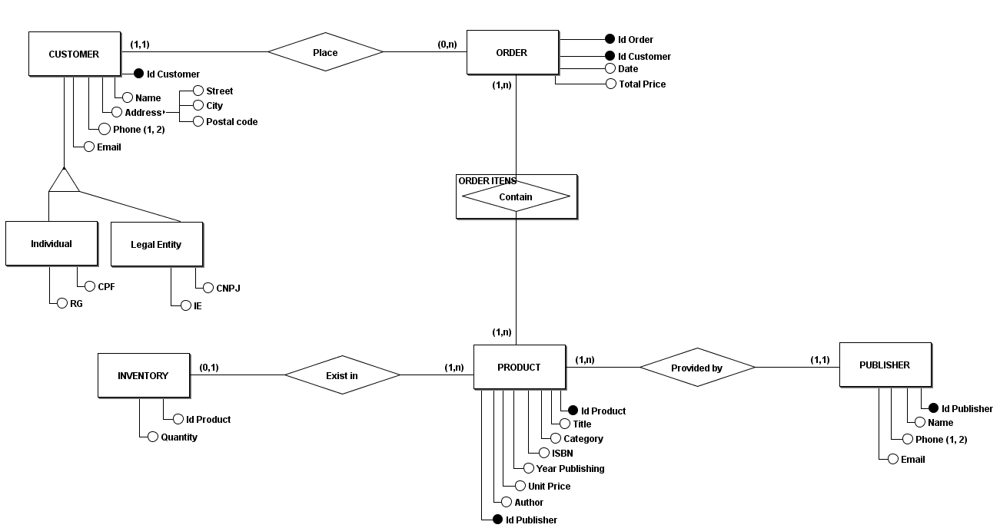

# DataModeling-BookStore
This repository contains a data project builded for a fictitious book store aimed to creating and modeling a database. 

## 1. Conceptual Model

#### Understanding business requirements

```
As a Brazilian bookstore, our business is growing and we need to improve our data organization. That's why it was decided to invest in a project to model and create a database.
We want to collect the personal data of our customers, such as whether he is an individual (CPF and RG) or a legal entity (CNPJ and IE). In addition, we want to collect and store your names, addresses, telephone numbers and email addresses.
The main product of e-commerce is books. These books have information associated with them such as title, category, ISBN (International Standard Book Number), year of publication, price, publisher, as well as the author of the work.
Books are provided by publishers. We need to keep the publisher's contact names, phone numbers (maximum 2 numbers) and email.
We know that we cannot have the same book coming from several publishers. The book is exclusive to one publisher.
Our customer can buy one or more books through a purchase order. However, whenever he makes a purchase, we need to check the inventory whether or not the book is available before carrying out the operation.
```

#### Visual representation
<p align="center">  </p>
This image was made using software:

[brModelo](https://www.brmodeloweb.com/lang/pt-br/index.html)


## 2. Logic Model


## 3. Physical Model

